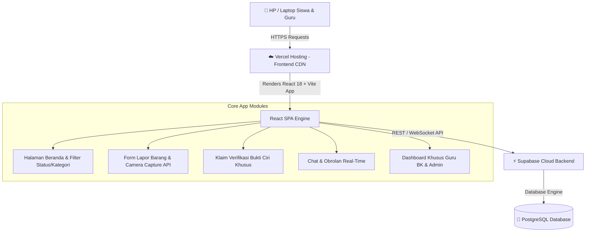

# Dokumentasi Spesifikasi & Arsitektur Sistem App SiTemu (Smart Lost & Found)

Dokumen ini berisi penjelasan menyeluruh mengenai arsitektur teknis aplikasi **SiTemu**, mulai dari **Frontend (Antarmuka Pengguna)**, **Backend (Cloud Service)**, **Skema Database PostgreSQL (Supabase)**, hingga **Pipeline Deployment (GitHub & Vercel)**.

---

## 🏗️ 1. Gambaran Umum Alur Arsitektur System

Aplikasi **SiTemu** dibangun menggunakan arsitektur **Single Page Application (SPA)** modern yang terhubung secara *real-time* ke **Cloud Backend (BaaS - Backend as a Service)**.



---

## 🎨 2. Arsitektur Frontend (Client-Side)

Frontend dikembangkan menggunakan **React 18** yang di-build menggunakan **Vite 5**.

### A. Core Technologies:
* **Library Utama**: `React 18` (Functional Components & React Hooks: `useState`, `useEffect`, `useRef`).
* **Icons & Styling**: `Lucide React` (Icon Set) + `Vanilla CSS3` dengan kustomisasi CSS variables.
* **Design System**: *Soft Slate Modern Mobile Frame* dengan ukuran locked `390px x 830px` (responsif 100vw pada layar HP).

### B. Fitur Unggulan Frontend:
1. **Fitur Tangkap Kamera HP (Native Camera API)**:
   - Menggunakan elemen HTML5 File Input `<input type="file" accept="image/*" capture="environment">`.
   - Mengubah file foto kamera menjadi format **Data URL / Base64** menggunakan `FileReader API` sehingga foto langsung tampil tanpa *delay* dan siap di-upload ke Supabase.
2. **Dynamic Ambient Status Glow**:
   - Tampilan visual aplikasi menyesuaikan jenis laporan secara otomatis (Merah `#ef4444` untuk Hilang, Hijau `#10b981` untuk Ditemukan, Biru `#2563eb` untuk Selesai).
3. **Mobile Touch & Gesture Optimization**:
   - Dilengkapi aturan `-webkit-tap-highlight-color: transparent` dan `user-select: none` agar menekan tombol/kartu di layar HP terasa seperti aplikasi native tanpa kotak biru HTML.

---

## ⚡ 3. Arsitektur Backend & Database (Supabase Cloud)

Backend aplikasi **SiTemu** memanfaatkan infrastruktur cloud **Supabase** yang didukung oleh database relasional **PostgreSQL**.

### A. Parameter Konfigurasi Supabase:
* **Project URL**: `https://mleglrbuyewdamygwatw.supabase.co`
* **Public Anon Key**: `sb_publishable_bGqcn1mJyqNvDosFi_K5sg_jib9XqKv`
* **SDK Connection**: Dikelola oleh modul `src/supabaseClient.js`.

---

## 🗄️ 4. Struktur Database & Skema Tabel (PostgreSQL)

Database SiTemu terdiri dari **5 Tabel Utama** yang saling terhubung:

### 1. Tabel `items` (Data Laporan Barang)
Menyimpan seluruh data laporan barang hilang maupun ditemukan di sekolah.

| Nama Kolom | Tipe Data | Deskripsi |
| :--- | :--- | :--- |
| `id` | `UUID / Text` | Primary Key unik tiap laporan barang |
| `title` | `VARCHAR(255)` | Nama/judul barang |
| `category` | `VARCHAR(50)` | Kategori (`hp`, `buku`, `kunci`, `dompet`, dll.) |
| `status` | `VARCHAR(20)` | Status laporan (`hilang`, `ditemukan`, `selesai`) |
| `location` | `TEXT` | Lokasi spesifik ditemukannya/hilangnya barang |
| `date_reported` | `TIMESTAMP / TEXT` | Tanggal & waktu pelaporan |
| `description` | `TEXT` | Deskripsi kronologi & ciri umum barang |
| `special_notes` | `TEXT` | Catatan bukti/ciri rahasia barang |
| `reporter_name` | `VARCHAR(100)` | Nama siswa/guru yang melapor |
| `reporter_role` | `VARCHAR(50)` | Peran pelapor (`Siswa` / `Guru BK`) |
| `reporter_avatar` | `TEXT` | URL foto profil pelapor |
| `image_url` | `TEXT` | URL/Base64 foto bukti barang |
| `created_at` | `TIMESTAMP` | Timestamp pembuatan data otomatis |

---

### 2. Tabel `profiles` (Data Pengguna / Siswa & Guru)
Menyimpan profil akun siswa dan guru di sekolah.

| Nama Kolom | Tipe Data | Deskripsi |
| :--- | :--- | :--- |
| `id` | `UUID / Text` | ID Pengguna |
| `name` | `VARCHAR(100)` | Nama lengkap siswa/guru |
| `role` | `VARCHAR(20)` | `siswa` atau `guru` |
| `nisn_nik` | `VARCHAR(50)` | NISN (Siswa) atau NIK/NIP (Guru) |
| `class_name` | `VARCHAR(50)` | Kelas (contoh: `XII RPL 1`) |
| `phone` | `VARCHAR(20)` | Nomor WhatsApp/Telepon aktif |
| `email` | `VARCHAR(100)` | Email pengguna |
| `avatar_url` | `TEXT` | Foto profil pengguna |

---

### 3. Tabel `verifications` (Validasi & Klaim Barang)
Menyimpan klaim pencocokan ciri rahasia antara pemilik dan penemu barang.

| Nama Kolom | Tipe Data | Deskripsi |
| :--- | :--- | :--- |
| `id` | `UUID / Text` | Primary Key Klaim |
| `item_id` | `UUID / Text` | Foreign Key mengarah ke `items.id` |
| `claimant_name` | `VARCHAR(100)` | Nama pengklaim |
| `proof_description` | `TEXT` | Jawaban ciri khusus yang diisi pengklaim |
| `status` | `VARCHAR(20)` | Status klaim (`pending`, `verified`, `rejected`) |
| `created_at` | `TIMESTAMP` | Timestamp pengajuan klaim |

---

### 4. Tabel `chats` & `messages` (Sistem Pesan Real-time)
Menyimpan riwayat obrolan antar siswa/guru mengenai barang tertentu.

* **`chats`**: Menyimpan sesi obrolan antar 2 pengguna per barang.
* **`messages`**: Menyimpan isi tiap pesan teks, pengirim (`sender_id`), dan timestamp pengiriman.

---

## 🚀 5. Alur Deployment & DevOps Pipeline

1. **Version Control System (GitHub)**:
   - Seluruh source code dikelola di repository Git: `clavinoarrafiiprasetyo2009-hash/App-Mobile-`.
   - Perubahan dikirim via perintah `git push origin main --force`.

2. **Automated CI/CD Deployment (Vercel)**:
   - Vercel memantau branch `main` pada GitHub.
   - Setiap ada *push* baru, Vercel otomatis menjalankan:
     ```bash
     npm install
     npm run build # (Vite Build -> dist/)
     ```
   - Berkat file `vercel.json`, seluruh rute aplikasi diarahkan ke `dist/index.html` (SPA Rewrite Rule) sehingga tidak pernah terjadi error 404 saat *refresh* browser.

---

## 📝 Ringkasan
Aplikasi **SiTemu** dirancang dengan standar teknologi modern yang **cepat, aman, responsif di HP, dan terhubung penuh ke Cloud Database**.
